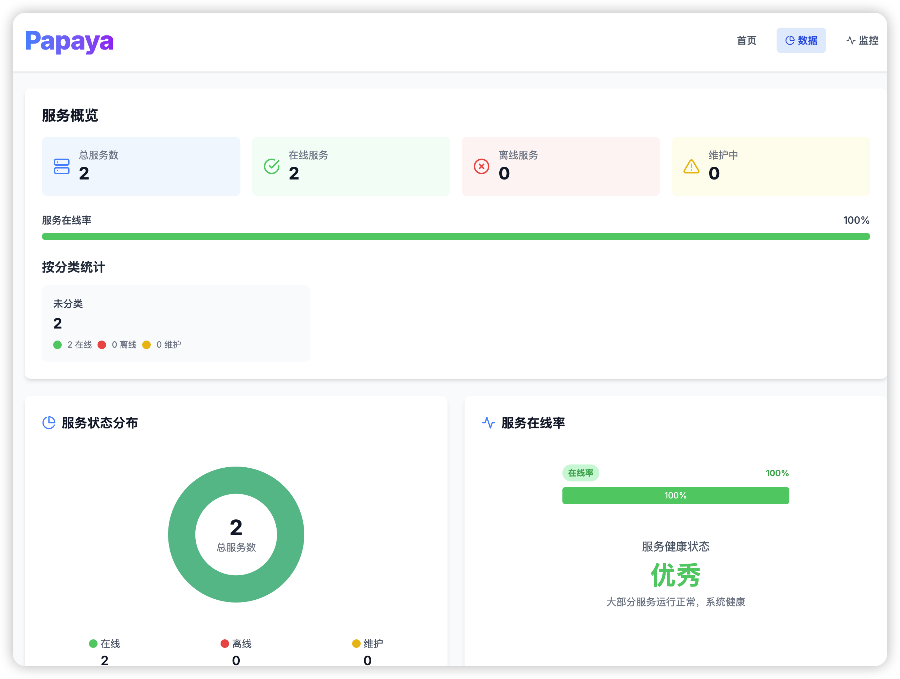
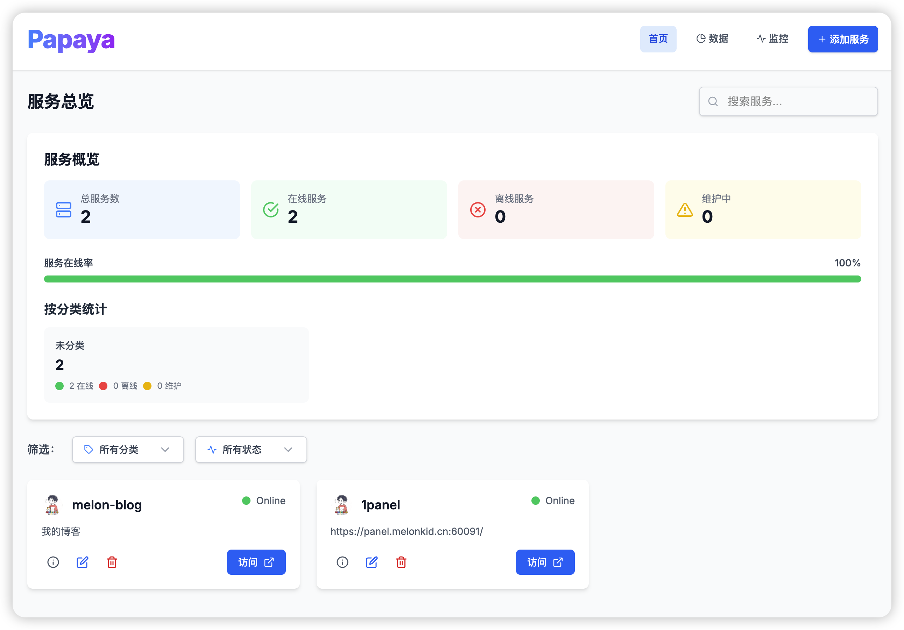

# MK-Papaya 个人服务治理工具

一个现代化的服务管理看板应用，用于监控和管理各种服务的状态和信息。




## 功能特点

- 📋 服务管理：添加、编辑、删除和查看服务
- 🚦 状态监控：实时监控和更新服务状态（在线、离线、维护中）
- 🔍 搜索和过滤：根据名称、描述、分类和状态筛选服务
- 📱 响应式设计：适配桌面和移动设备
- 🌙 深色模式：支持明亮和暗黑主题
- 💾 数据持久化：所有数据安全存储在后端

## 技术栈

### 前端
- **Next.js**: React 框架，用于构建用户界面
- **TypeScript**: 类型安全的 JavaScript 超集
- **Tailwind CSS**: 实用优先的 CSS 框架
- **React Icons**: 图标库

### 后端
- **Express.js**: Node.js Web 应用框架
- **fs-extra**: 文件系统操作增强库
- **uuid**: 生成唯一标识符

## 项目结构

```
mk-kanban/
├── src/                  # 前端源代码
│   ├── app/              # Next.js 页面
│   ├── components/       # React 组件
│   ├── lib/              # 工具函数和 API 客户端
│   └── types/            # TypeScript 类型定义
├── kanban-server/        # 后端服务
│   ├── src/              # 后端源代码
│   │   ├── routes/       # API 路由
│   │   ├── services/     # 数据服务
│   │   └── types/        # 类型定义
│   └── data/             # 数据存储
└── public/               # 静态资源
```

## 快速开始

### 前提条件

- Node.js (v18 或更高版本)
- npm 或 yarn

### 安装

1. 克隆仓库
```bash
git clone https://github.com/yourusername/mk-kanban.git
cd mk-kanban
```

2. 安装前端依赖
```bash
npm install
```

3. 安装后端依赖
```bash
cd kanban-server
npm install
cd ..
```

### 运行

#### 使用启动脚本（推荐）

项目提供了便捷的启动脚本，可以一键启动前端和后端服务：

```bash
# 添加执行权限
chmod +x start.sh stop.sh status.sh

# 启动所有服务
./start.sh

# 查看服务状态
./status.sh

# 停止所有服务
./stop.sh
```

这些脚本会在后台运行服务，并将日志保存在`logs/`目录中。

#### CentOS/RHEL系统

如果您使用的是CentOS或RHEL系统，可能需要安装一些额外的依赖。我们提供了一个安装脚本：

```bash
# 添加执行权限
chmod +x install-deps.sh

# 使用root权限运行安装脚本
sudo ./install-deps.sh
```

这个脚本会安装必要的工具（如lsof、curl等）和Node.js环境，并设置项目依赖。

#### 开发环境

1. 启动后端服务
```bash
cd kanban-server
npm run dev
```

2. 在新的终端窗口中启动前端应用
```bash
# 在项目根目录下
npm run dev
```

3. 打开浏览器访问 http://localhost:3000

#### 生产环境

1. 构建前端项目
```bash
# 在项目根目录下
npm run build
```

2. 启动前端项目
```bash
npm run start
```

3. 构建后端项目
```bash
cd kanban-server
npm run build
```

4. 启动后端服务
```bash
npm run start
```

5. 配置反向代理（推荐使用Nginx）将前端请求转发到后端API

### 环境变量配置

项目支持通过环境变量配置前端和后端端口。您可以通过创建`.env`文件来配置环境变量：

```bash
# 复制示例配置文件
cp .env.example .env

# 编辑配置文件
nano .env
```

可配置的环境变量包括：

```
# 前端端口配置
PORT=3000

# 后端端口配置
BACKEND_PORT=3001

# API基础URL
NEXT_PUBLIC_API_URL=http://localhost:3001/api
```

如果您使用启动脚本，这些环境变量会自动被加载。如果您手动启动服务，可以这样使用环境变量：

```bash
# 启动前端服务
PORT=8000 npm run dev

# 启动后端服务
cd kanban-server
BACKEND_PORT=8001 npm run dev
```

## API 接口

### 服务管理

- `GET /api/services` - 获取所有服务
- `GET /api/services/:id` - 获取单个服务
- `POST /api/services` - 添加新服务
- `PUT /api/services/:id` - 更新服务
- `DELETE /api/services/:id` - 删除服务
- `PATCH /api/services/:id/status` - 更新服务状态

## 使用指南

### 添加新服务

1. 点击首页右上角的"+"按钮
2. 填写服务信息（名称、描述、URL、状态等）
3. 点击"添加服务"按钮

### 更新服务状态

1. 导航到"状态"页面
2. 在服务列表中找到目标服务
3. 使用状态下拉菜单选择新状态（在线、离线、维护中）

### 编辑或删除服务

1. 点击服务卡片进入详情页面
2. 使用编辑按钮修改服务信息
3. 使用删除按钮移除服务

## 前端开发指南

### 项目结构

```
src/
├── app/                  # Next.js 应用页面
│   ├── page.tsx          # 首页
│   ├── dashboard/        # 数据中心页面
│   ├── status/           # 服务状态页面
│   ├── services/         # 服务详情页面
│   └── layout.tsx        # 全局布局
├── components/           # 可复用组件
│   ├── Header.tsx        # 顶部导航栏
│   ├── Navbar.tsx        # 底部导航栏
│   ├── ServiceCard.tsx   # 服务卡片组件
│   ├── ServiceForm.tsx   # 服务表单组件
│   └── ...               # 其他组件
├── lib/                  # 工具函数和API客户端
│   ├── api.ts            # API调用函数
│   └── services.ts       # 服务相关工具函数
├── styles/               # 样式文件
│   ├── globals.css       # 全局样式
│   └── dropdownStyles.ts # 下拉框样式常量
└── types/                # TypeScript类型定义
    └── index.ts          # 类型定义文件
```

### 自定义主题

项目使用Tailwind CSS进行样式管理。要自定义主题，可以编辑`tailwind.config.js`文件：

```js
// tailwind.config.js
module.exports = {
  theme: {
    extend: {
      colors: {
        // 自定义颜色
        primary: {
          50: '#f0f9ff',
          // ...其他色阶
          600: '#0284c7',
        },
        // 添加更多自定义颜色
      },
      // 其他自定义主题配置
    },
  },
  // 其他配置
};
```

### 添加新页面

1. 在`src/app`目录下创建新的目录或文件
2. 创建React组件作为页面内容
3. 使用Next.js的路由系统自动识别新页面

示例：
```tsx
// src/app/new-page/page.tsx
'use client';

import React from 'react';
import Header from '@/components/Header';
import Navbar from '@/components/Navbar';

export default function NewPage() {
  return (
    <div className="min-h-screen bg-gray-50 dark:bg-gray-900">
      <Header title="新页面" />
      <main className="max-w-7xl mx-auto px-4 sm:px-6 lg:px-8 py-6">
        {/* 页面内容 */}
      </main>
      <Navbar />
    </div>
  );
}
```

### 故障排除

#### API连接问题

如果前端无法连接到后端API，请检查：

1. 后端服务是否正在运行
2. API基础URL是否正确配置
3. 网络连接和CORS设置

解决方案：
- 确保后端服务在正确的端口上运行
- 检查`src/lib/api.ts`中的`API_BASE_URL`配置
- 创建`.env.local`文件并设置`NEXT_PUBLIC_API_URL`

#### 构建错误

如果遇到构建错误，请尝试：

1. 清除Next.js缓存：`rm -rf .next`
2. 重新安装依赖：`npm ci`
3. 检查TypeScript类型错误：`npm run lint`

## 许可证

[MIT](LICENSE)

## 联系方式

如有问题或建议，请提交 issue 或联系 [melonkid](iworkvip@gmail.com)
